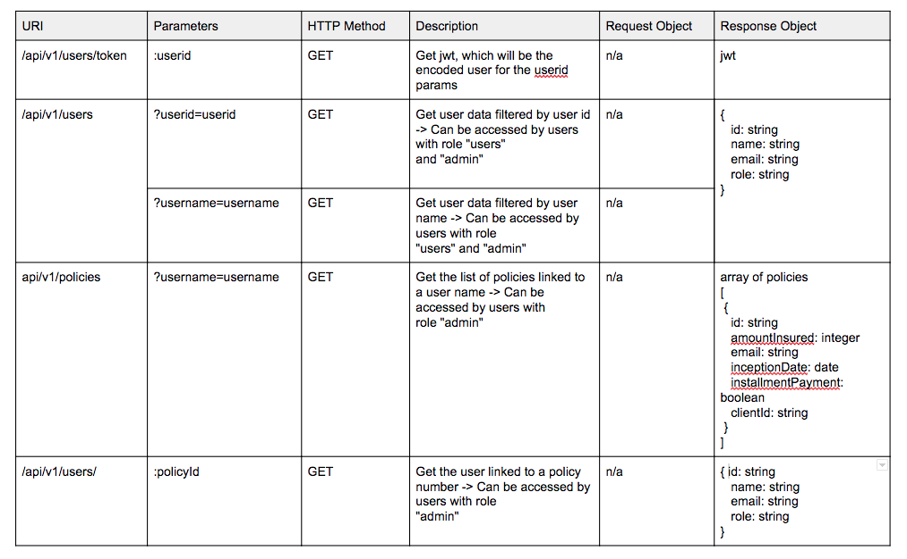

# Backend development
for an application that manages information about insurance policies and company clients.

## STACK & 3rd PARTY LIBRARIES
  - [ ] node.js
  - [ ] Express
  - [ ] axios
  - [ ] jsonwebtoken
  - [ ] dotenv

## Data
  - [ ] The list of company clients
    - [CLIENTS](http://www.mocky.io/v2/5808862710000087232b75ac)

  - [ ] The list of company policies
    - [POLICIES](http://www.mocky.io/v2/580891a4100000e8242b75c5)

## AUTHENTICATION & AUTHORIZATION

  - Assumption: every user is aware of their own id (in frontend)

  - With this userid, user can access to the endpoint as get(/api/vi/users/token/:userid)
    - In the response of this endpoint JWT will be generated, which will be the encoded user for the userid params
    - Any future request to the protected enpoint must have jwt within the authorization header

  - Middleware(checktoken) protects the each methods and endpoints according to the role
    - middleware will decode the jwt, which is present in the authorization header of the request to the protected enpoint and it ensures that the user's role matches one of the any of the requiered roles defined by the middleware paremeters.  
    - only if the role of that user which is encrypted in the jwt is allowed for any partiular endpoint, the user will be able to see the results

## API ROUTES PLAN
  
   
   

## SETUP

### Dependencies
Run `npm install` to install dependencies.

### Run Your Start
Run `nodemon` in your terminal .

